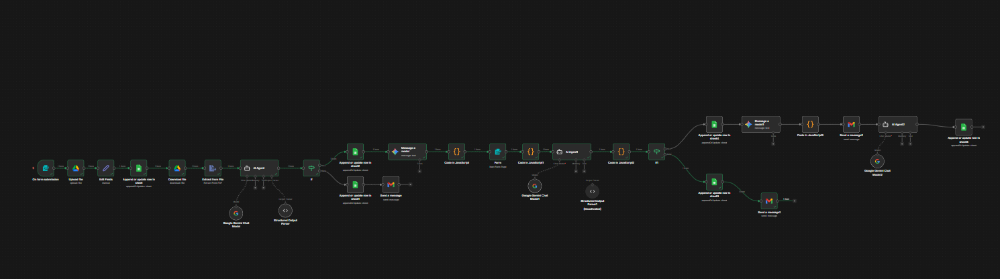

# 🚀 HirePilot — AI HR Screening Agent


**HirePilot** is an AI-powered recruitment automation agent built using n8n and modern LLMs.  
It streamlines early-stage hiring by automatically analyzing resumes, generating contextual screening questions, computing ATS-style scores, and sending personalized candidate emails.  
The goal is to reduce manual HR workload through intelligent workflow automation.

---

## 🧠 What HirePilot Does

HirePilot simulates a real-world AI-assisted hiring pipeline.  
Once candidate data is provided, the workflow extracts resume insights, evaluates candidate relevance using an LLM, and produces structured outputs for decision support.  
The system is designed with modular n8n nodes so it can be easily extended into a production-grade recruitment assistant.  
It demonstrates how deterministic automation and probabilistic AI can work together in HR tech.  
This project focuses on practical, scalable workflow orchestration rather than just prompt-based AI demos.

---

## 📸 Workflow Preview



---

## 🛠 Tech Stack

- **Workflow Engine:** n8n  
- **LLM Integration:** Gemini / OpenAI  
- **Automation Logic:** JavaScript (Code nodes)  
- **Email Service:** Gmail API  
- **Data Format:** Structured JSON  

---

## 🚀 Future Enhancements

- 🔜 Advanced ATS scoring model  
- 🔜 Webhook-based real-time intake  
- 🔜 Vector database memory (RAG)  
- 🔜 Interview scheduling automation  
- 🔜 Recruiter analytics dashboard  

---

## 📂 Access the Workflow JSON

The complete n8n workflow is available in:

ai-hr-screening-workflow.json


You can import this directly into your local n8n instance to reproduce the automation pipeline.

---

## ⚙️ Setup Instructions

### 1. Install n8n

```bash
npm install -g n8n
n8n start

```

## 📜 License

This project is licensed under the MIT License.

---

## 👨‍💻 Built With Passion By

 Anurup Dasari

AI Automation • Workflow Engineering • Intelligent Systems

